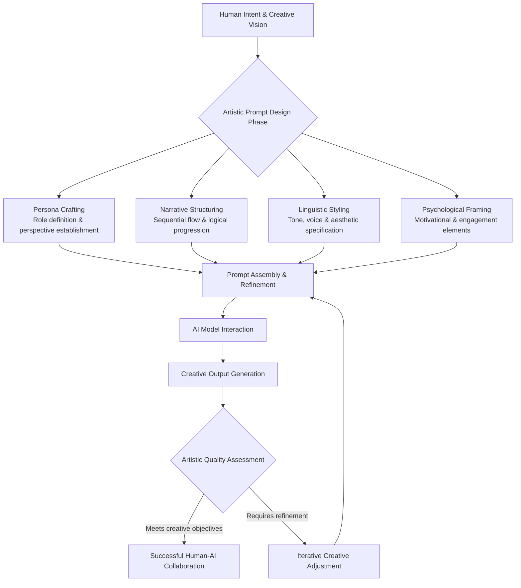

    

<h1 align="center">BLACXQUAD SECURITY INTERNATIONAL</h1>
<h3 align="center">GUARDIANS OF THE DIGITAL COMMONS!</h3>

  

    

    
 

  

    

> [!IMPORTANT]

This work is licensed under the **Creative Commons Attribution-ShareAlike 4.0 International License** (CC BY-SA 4.0).

When using, redistributing, adapting, or building upon this material, you **must** provide proper attribution by:

- 1. **Clearly stating the original source** as the **BLACXQUAD GitHub repository**.
- 2. **Including the exact URL(s)** to the relevant repository or file(s).

**Example Attribution Format:**  
- This work is based on content from the BLACXQUAD GitHub repository, available at:  
- https://github.com/blacxquad/blacxquad/blob/main/genai_and_prompt_engineering.md#the-art-and-science-of-prompt-engineering-crafting-the-human-ai-interface 

Under the CC BY-SA license, you **must also**:
- Indicate if changes were made.
- License any adapted material under **identical terms** (CC BY-SA 4.0).

Failure to provide accurate source attribution violates the license terms.

    

> [!CAUTION]
> **Disclaimer & Best Practices:** This document is intended as a comprehensive guide. Always refer to the latest documentation and specifications from your respective model provider (e.g., OpenAI's GPT-4, GPT-4-turbo, GPT-3.5-turbo; Anthropic's Claude 3 Opus, Sonnet, Haiku; Google's Gemini 1.5, Gemini 1.0 Pro, PaLM 2; Meta's Llama 3, Llama 2; Mistral AI's Mixtral 8x7B, Mistral 7B; Cohere's Command R+; DeepSeek's DeepSeek-V2, DeepSeek R1; and all other applicable foundation models). Treat all user input as untrusted and implement rigorous sanitization and logical separation between user instructions and system commands to prevent prompt injection attacks and jailbreaking attempts. Never input sensitive, proprietary, or private data into public API-based models without proper anonymization, contractual agreements (such as a Business Associate Agreement (BAA) for healthcare data or a Data Processing Agreement (DPA)), and a full understanding of the provider's data processing and retention policies.

    

<h1 align="center">The Art and Science of Prompt Engineering: Crafting the Human-AI Interface.</h1>

 

## Introduction: The Conduit of Human-AI Collaboration

Prompt engineering has emerged as the fundamental discipline governing human interaction with artificial intelligence, serving as the essential conduit between human intent and machine execution. In the current technological paradigm, the efficacy of advanced AI systems is no longer determined solely by algorithmic sophistication or computational scale, but by the quality of their interaction with human operators. This multidisciplinary fusion of linguistics, computer science, ethics, and cognitive psychology is dedicated to the meticulous crafting of inputs that elicit precise, reliable, and valuable outputs from generative AI models. As organizations increasingly deploy Large Language Models across critical business functions, mastering prompt engineering has become a cornerstone capability for unlocking AI's transformative potential while ensuring safety, reliability, and alignment with organizational objectives.

## Section 1: The Art of Prompt Engineering

### The Creative Craftsmanship of Language

The artistic dimension of prompt engineering involves the intuitive and creative application of language to guide AI systems toward desired outcomes. This requires a nuanced understanding of context, psychology, and communicative nuance to design prompts that function not merely as instructions but as evocative catalysts for intelligent response generation.

*   **Linguistic Intuition and Creative Framing**: Effective prompt engineering begins with the artistic framing of requests, transforming vague human intentions into structured narratives that AI systems can co-author. This involves selecting vocabulary that resonates with the model's training, employing rhetorical structures that emphasize priority, and crafting contextual framing that establishes appropriate boundaries. The art lies in anticipating how subtle variations in phrasing—choosing "synthesize" versus "summarize," or "analyze critically" versus "describe"—fundamentally alter the model's approach to task execution, requiring practitioners to develop sensitivity to linguistic nuance rarely needed in traditional human communication.
*   **Psychological Engagement and Role Assignment**: Advanced prompt engineering utilizes psychological principles by assigning specific roles or personas to the AI, thereby activating relevant knowledge patterns and behavioral templates. Instructions such as "Act as a seasoned financial analyst with 20 years of experience in emerging markets" or "Respond as a compassionate healthcare provider explaining a complex diagnosis" leverage the model's training on diverse textual sources to adopt specialized perspectives. This technique not only improves response quality but also establishes appropriate tone, depth, and domain-specific framing, effectively "priming" the model to access the most relevant portions of its parametric knowledge.
*   **Narrative Structure and Sequential Guidance**: The artistic dimension extends to structuring complex interactions as coherent narratives with clear progression. This involves breaking multifaceted tasks into logical sequences, establishing cause-effect relationships within the prompt, and designing conversational flow that maintains context across extended exchanges. Techniques such as chain-of-thought prompting ("Let's work through this step by step") explicitly model reasoning processes, while maintaining narrative consistency across multi-turn dialogues requires careful management of contextual threads—a skill blending storytelling with technical precision.
*   **Aesthetic Considerations and Stylistic Control**: Beyond functional accuracy, artistic prompt engineering addresses stylistic elements including tone, voice, complexity, and rhetorical flourishes. Practitioners specify desired stylistic attributes through comparative language ("in the style of Hemingway's concise prose"), direct characterization ("use academic formal register with technical terminology"), or exemplar demonstrations. This dimension transforms AI from an information retrieval system into a collaborative creative partner capable of adapting its expressive output to match brand guidelines, audience expectations, or specific communicative purposes.

### The Artisan's Toolkit: Creative Techniques in Practice

| **Artistic Technique** | **Mechanism of Action** | **Example Implementation** | **Optimal Use Case** |
| :--- | :--- | :--- | :--- |
| **Persona/Role Assignment** | Activates domain-specific knowledge patterns and behavioral templates | "You are a veteran software architect reviewing code for security vulnerabilities. Adopt a meticulous, detail-oriented approach." | Domain-specific queries requiring specialized knowledge or perspective |
| **Chain-of-Thought Prompting** | Forces explicit stepwise reasoning, reducing logical leaps and errors | "First, identify the core problem. Second, analyze contributing factors. Third, propose and evaluate solutions." | Complex reasoning tasks, mathematical problems, strategic planning |
| **Few-Shot Exemplars** | Provides concrete examples of desired input-output patterns | "Example 1: Input: 'The meeting is at 3 PM.' Output: {'event': 'meeting', 'time': '15:00'}. Now convert: 'Dinner scheduled for 7:30.'" | Tasks requiring specific formatting, classification, or transformation patterns |
| **Metaphorical Framing** | Leverages conceptual metaphors to shape problem understanding | "Approach this business challenge as if it were a chess game, considering strategic positioning and anticipated counter-moves." | Creative problem-solving, strategic planning, innovative thinking |
| **Stylistic Specification** | Directs linguistic style through comparative or descriptive language | "Explain quantum entanglement using the clear, engaging analogies typical of Carl Sagan's popular science writing." | Content creation, marketing materials, educational resources |

*   **Iterative Refinement Through Creative Experimentation**: The artistic process in prompt engineering is inherently iterative, requiring continuous experimentation, evaluation, and refinement. Practitioners develop intuition through systematic testing of variations, learning which phrasings consistently yield superior results across different model versions and task types. This creative experimentation follows patterns observed in other design disciplines: exploration of alternatives, convergence toward effective solutions, and adaptation to emerging constraints. The most skilled prompt engineers maintain portfolios of effective patterns while continuously exploring novel approaches, balancing proven techniques with innovative experimentation to address new challenges.

## Section 2: The Science of Prompt Engineering

### The Technical Foundation of Model Interaction

The scientific dimension of prompt engineering is grounded in rigorous understanding of large language model architecture, statistical properties, and computational behavior. This systematic approach treats prompts as engineered inputs that directly influence probability distributions within transformer-based neural networks, requiring precise technical knowledge to achieve reliable, scalable results.

*   **Architectural Understanding and Tokenization Mechanics**: At its most fundamental level, prompt engineering operates within the technical constraints of transformer architecture. Each prompt undergoes tokenization—segmentation into subword units that the model processes numerically—with different tokenization schemes significantly affecting how instructions are interpreted. Scientific prompt engineering requires understanding how models allocate attention across token sequences, how positional encoding affects semantic interpretation, and how context windows limit information retention. This knowledge enables engineers to structure prompts to maximize information density within token limits, position critical instructions in optimal attention locations, and avoid fragmentation of semantically meaningful units across token boundaries.
*   **Statistical Optimization and Parameter Tuning**: Beyond linguistic content, scientific prompt engineering involves precise calibration of generation parameters that control the model's sampling behavior. Temperature settings regulate randomness in output selection, with lower values (0.1-0.3) producing more deterministic, focused responses ideal for factual tasks, while higher values (0.7-0.9) increase creativity for generative applications. Top-k and top-p sampling parameters provide additional control over the probability distribution from which tokens are selected, enabling fine-tuning of the diversity-reliability tradeoff. Systematic engineers establish parameter configurations through empirical testing against validation datasets, documenting performance characteristics across different task types and model versions.
*   **Systematic Testing and Performance Measurement**: The scientific approach implements rigorous evaluation methodologies, treating prompt engineering as a hypothesis-driven experimentation process. This involves creating benchmark datasets that represent production use cases, establishing quantitative metrics for accuracy, relevance, and safety, and conducting controlled A/B testing of prompt variations. Engineers implement continuous evaluation pipelines that automatically test prompts against regression suites after model updates or system changes, detecting performance degradation before it affects users. This data-driven approach transforms prompt development from artistic intuition to reproducible engineering practice with measurable outcomes and predictable scaling properties.
*   **Architectural Integration and System Design**: Scientific prompt engineering extends beyond individual prompts to design complete interaction systems. This includes implementing retrieval-augmented generation (RAG) architectures that ground responses in external knowledge bases, designing fallback mechanisms for uncertain queries, and creating validation layers that verify output compliance with schemas or safety guidelines. The engineering perspective considers computational efficiency, implementing caching strategies for frequent queries, optimizing token usage to control costs, and designing scalable serving infrastructure that maintains performance under variable load. This systems thinking distinguishes professional prompt engineering from casual experimentation.

### The Engineering Toolkit: Scientific Methods and Technical Controls

| **Scientific Dimension** | **Technical Implementation** | **Measurement Approach** | **Engineering Outcome** |
| :--- | :--- | :--- | :--- |
| **Token Optimization** | Strategic prompt construction minimizing token count while preserving meaning | Token usage analytics, compression ratio measurement | Reduced inference cost and latency with maintained accuracy |
| **Parameter Calibration** | Systematic testing of temperature, top-p, and top-k values across task types | Controlled experiments with statistical significance testing | Optimized balance between creativity and reliability for specific applications |
| **Architectural Grounding** | Integration with vector databases, knowledge graphs, and external APIs | Retrieval precision/recall metrics, hallucination rate measurement | Factually accurate outputs with verifiable source attribution |
| **Systematic Evaluation** | Automated testing against golden datasets with multi-metric assessment | Accuracy, relevance, safety, and latency benchmarking | Reliable performance meeting predefined service level objectives |
| **Version Control & CI/CD** | Prompt versioning, automated deployment pipelines, canary testing | Change success rate, rollback frequency, deployment velocity | Safe, controlled evolution of production prompt systems |

*   **Formalization and Pattern Documentation**: The scientific approach emphasizes formalization of successful prompt patterns into reusable templates with clearly defined parameters and constraints. Engineers develop schema for different task types—classification, extraction, summarization, generation—with documented performance characteristics across model families. This formalization enables knowledge sharing across teams, accelerates development of new applications through pattern reuse, and establishes organizational standards for prompt quality and safety. The most mature implementations include prompt compilers that transform high-level task descriptions into optimized model inputs, abstracting technical complexity while ensuring consistent application of best practices.

## Synthesis: The Interplay of Art and Science in Production Systems

### Creating Effective and Robust Prompts Through Integrated Practice

The most impactful prompt engineering practice emerges from the symbiotic integration of artistic creativity and scientific rigor. This interdisciplinary approach recognizes that truly effective prompts must simultaneously engage the model's creative potential while operating within precise technical constraints, balancing expressive freedom with reliable performance.

*   **Human-Centric Design Meets Engineering Discipline**: Successful prompt engineering begins with artistic understanding of human communication patterns, contextual nuance, and psychological framing, then applies engineering discipline to ensure reliability, safety, and scalability. The artistic dimension ensures prompts feel natural and intuitive to human users while effectively guiding the AI, while the scientific dimension implements validation, testing, and monitoring to prevent failures. This integration is particularly crucial in production systems where prompts must maintain consistent performance across diverse user populations, evolving model versions, and variable input conditions while preserving the nuanced understanding required for complex tasks.
*   **Iterative Development with Dual Feedback Loops**: Professional prompt engineering implements iterative development processes that incorporate both qualitative artistic assessment and quantitative scientific measurement. Each prompt variation undergoes artistic evaluation for tone, nuance, and communicative effectiveness alongside scientific testing for accuracy, latency, and resource utilization. This dual feedback loop ensures prompts evolve toward optimal solutions that satisfy both human experiential requirements and technical operational constraints. The most mature organizations implement continuous improvement cycles where production usage data informs both creative refinements and technical optimizations, creating progressively more effective prompts over time.
*   **Risk Mitigation Through Complementary Approaches**: The integration of art and science provides complementary risk mitigation strategies for deploying AI systems. The artistic focus on nuanced understanding, ethical framing, and contextual sensitivity addresses risks of miscommunication, inappropriate tone, and cultural insensitivity. Simultaneously, the scientific focus on validation, testing, and monitoring addresses risks of factual error, performance degradation, and security vulnerabilities. Together, these approaches create defense-in-depth against the multifaceted risks of generative AI, enabling organizations to deploy powerful systems with appropriate confidence in their reliability and safety.

### Impact on Organizational AI Capability

The disciplined integration of artistic and scientific prompt engineering practices transforms how organizations leverage generative AI, moving from experimental applications to production-ready systems that deliver consistent business value. Organizations that master both dimensions achieve:

- **Higher ROI on AI Investments**: More effective prompts extract greater capability from existing models, delaying or avoiding expensive model upgrades or custom training while improving task success rates
- **Reduced Operational Risk**: Systematic testing and validation prevent deployment of ineffective or unsafe prompts, while artistic attention to nuance reduces reputational risks from tone-deaf or inappropriate responses
- **Faster Development Cycles**: Reusable patterns and systematic testing accelerate prompt development for new applications, while artistic intuition quickly addresses edge cases and nuanced requirements
- **Improved User Adoption and Satisfaction**: Artistically crafted prompts create more natural, engaging interactions that users prefer, while scientifically engineered reliability builds trust through consistent performance
- **Scalable Governance and Compliance**: Scientific documentation and version control enable audit trails and compliance reporting, while artistic attention to ethical framing ensures alignment with organizational values

## Mastering the Human-AI Interface

Prompt engineering represents the critical frontier in human-AI collaboration, demanding mastery of both creative language craftsmanship and systematic technical engineering. The artistic dimension—rooted in linguistics, psychology, and design thinking—ensures that AI interactions feel intuitive, contextually appropriate, and effectively guide the model's creative and reasoning capabilities. The scientific dimension—grounded in computer science, statistics, and systems engineering—ensures reliability, scalability, and safety through rigorous testing, optimization, and architectural integration.

As generative AI becomes increasingly embedded in organizational processes and customer interactions, the organizations that thrive will be those that recognize prompt engineering not as a peripheral technical skill but as a core strategic capability. By cultivating teams that balance artistic intuition with engineering discipline, and by implementing processes that value both creative exploration and systematic validation, enterprises can unlock the full potential of AI while managing the inherent risks of these powerful systems. The future of human-AI collaboration will be written not only in model architectures and training algorithms, but equally in the carefully crafted prompts that guide these systems toward beneficial, reliable, and human-aligned outcomes.

The art and science of prompt engineering, when practiced in integrated harmony, transforms AI from an impressive but unpredictable technology into a reliable partner for augmentation and innovation—a testament to human ingenuity in shaping increasingly intelligent machines to serve human purposes with both creative flair and engineering precision.

    

<h2 align="center">STAY TUNED FOR THE LATEST UPDATES!</h2>

  

    

